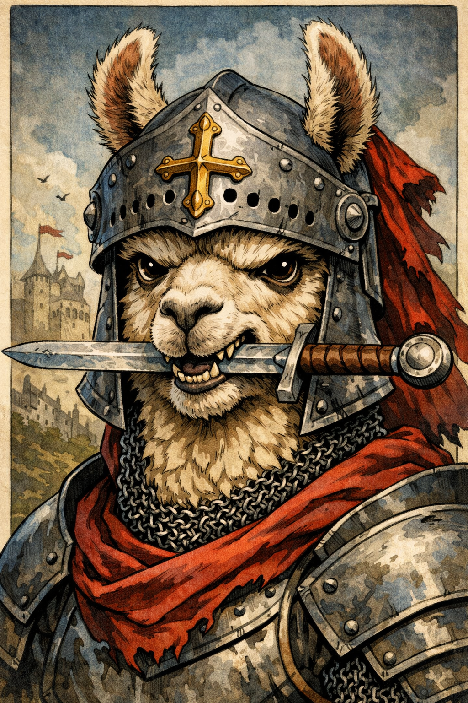

# Dungeo-ai
  
An interactive text-based adventure game powered by local LLMs through Ollama. Immerse yourself in dynamically generated stories across multiple genres and time periods, with a focus on action-driven, immediate consequences.

[](#)
[](https://www.python.org/)
[](https://ollama.com/)
[](https://opensource.org/licenses/MIT)
[](#)
[](https://huggingface.co/)

## ✨ Features

- **Multiple Genres**: Choose from 10 different settings:
     - Fantasy
     - Sci-Fi
     - Cyberpunk
     - WW1
     - WW2
     - Roman Empire
     - 1880
     - 1925 New York
     - French Revolution
     - Roman Empire

- **Rich Character Selection**: Over 100 unique roles
- **Action-Focused Gameplay**: Every action has immediate, logical consequences
- **Local AI Processing**: Uses Ollama for private, offline AI generation
- **Simple and minimalistic Terminal UI**: Built with Rich for immersive text-based experience
- **Save & Export**: Save your progress and export adventures as text files
- **Model Compatibility**: Works with any Ollama model (Llama 3.1, Mistral, etc.)

## 🚀 Quick Start

### Prerequisites

1. **Python 3.8+**
2. **Ollama** installed and running

### Installation

1. Install Ollama from [ollama.ai](https://ollama.ai)
2. Pull a model (example):
   ```bash
   ollama pull HammerAI/mn-mag-mell-r1
   ```
3. Clone this repository:
   ```bash
   git clone https://github.com/Laszlobeer/Dungeo-ai-new.git
   cd llm-adventure-game
   ```
4. Install Python dependencies:
   ```bash
   pip install rich
   ```

### Running the Game

```bash
python main.py
```

## 🎮 Gameplay

### Starting a New Game
1. Select an AI model from your available Ollama models
2. Choose a character name
3. Pick a genre (Fantasy, Sci-Fi, Cyberpunk, etc.)
4. Select a role within that genre
5. Begin your adventure!

### Example Session
```
🎭 LLM Adventure Game 🎭
Powered by Ollama

Genre: Fantasy
Role: Knight
Character: Sir Lancelot

The Adventure Begins:
You're training in the castle courtyard when...

Action » I draw my sword and challenge the training dummy

━━━ World Response ━━━
Your blade flashes from its scabbard with a metallic ring. The practice dummy stands unmoving, its straw-stuffed body waiting. You take a fighting stance, feet planted firmly on the cobblestones. The weight of the sword feels familiar in your hands.
```

## 📋 Available Commands

| Command | Description |
|---------|-------------|
| `/help` | Show all available commands |
| `/quit`, `/exit` | Exit the game |
| `/restart` | Start a new game |
| `/save` | Save current game state |
| `/load` | Load a saved game |
| `/export_txt` | Export adventure as text file |
| `/history` | Show recent history |
| `/stats` | Show game statistics |
| `/redo` | Redo the last action with new response |

## 🗺️ Supported Genres & Roles

### Fantasy (23 roles)
- Knight, Mage, Ranger, Thief, Bard, Cleric, Assassin, Paladin, Alchemist, Druid, Warlock, Monk, Sorcerer, Beastmaster, Enchanter, Blacksmith, Merchant, Gladiator, Wizard, Peasant, Noble, Mage, Peasant

### Sci-Fi (19 roles)
- Space Marine, Scientist, Android, Pilot, Engineer, Alien Diplomat, Bounty Hunter, Starship Captain, Space Pirate, Navigator, Robot Technician, Cybernetic Soldier, Explorer, Astrobiologist, Quantum Hacker, Galactic Trader, AI Specialist, Terraformer, Cyberneticist

### Cyberpunk (13 roles)
- Hacker, Street Samurai, Corporate Agent, Techie, Rebel Leader, Cyborg, Drone Operator, Synth Dealer, Information Courier, Augmentation Engineer, Black Market Dealer, Scumbag, Police

### Historical Settings
- **WW1**: 11 roles including soldiers from various nations, civilians, resistance fighters
- **WW2**: 19 roles including soldiers, pilots, spies, medics, commandos
- **Roman Empire**: 14 roles including Gladiator, Senator, Slave, Emperor
- **French Revolution**: 8 roles including Peasant, King, Noble, Revolutionary
- **1880 Industrial Era**: 12 roles including Thief, Detective, Factory Worker
- **1925 New York**: 6 roles including Mafia Boss, Bootlegger, Detective

### Post-Apocalyptic (9 roles)
- Survivor, Scavenger, Raider, Medic, Cult Leader, Mutant, Trader, Berserker, Soldier

## 💾 Save System

The game automatically saves your progress and allows manual saving/loading:

- **Auto-save**: Every 5 actions
- **Manual save**: `/save` command
- **Load game**: `/load` command
- **Export**: Create readable text files with `/export_txt`

Saved games are stored in `adventure_saves/` and exports in `adventure_exports/`

## 🔧 Technical Details

### AI Integration
- Uses Ollama's REST API for local LLM inference
- Supports any model available in Ollama
- Custom prompt engineering for action-focused responses
- Automatic model detection and fallback mechanisms

### Action Analysis System
The game analyzes each action to provide better responses:
1. **Verb/Object Extraction**: Identifies key action elements
2. **Action Classification**: Combat, Magic, Social, Investigation, etc.
3. **Intensity Detection**: High, Medium, Low based on adverbs
4. **Context Building**: Genre and role-specific context injection

### Response Quality
The AI is guided to provide:
- Immediate consequences (2-4 sentences)
- Direct cause-and-effect relationships
- Genre-appropriate physics/magic systems
- No unrelated events or setup descriptions

## 🐛 Troubleshooting

### Common Issues

1. **"Ollama not running"**
   ```bash
   # Start Ollama service
   ollama serve
   ```

2. **"No models found"**
   ```bash
   # Pull a model
   ollama pull HammerAI/mn-mag-mell-r1
   ```

3. **Python dependencies missing**
   ```bash
   pip install rich
   ```

4. **Connection refused**
   - Ensure Ollama is running on `127.0.0.1:11434`
   - Check firewall settings

### Debug Mode
For debugging, you can enable action analysis display in the UI.

## 🎯 Tips for Best Experience

1. **Be Specific**: Instead of "attack," try "I swing my sword at the orc's legs"
2. **Use Genre-Appropriate Actions**: Magic in Fantasy, tech in Sci-Fi, etc.
3. **Consider Your Role**: A Thief might pick locks, a Knight might challenge honorably
4. **Chain Actions**: Build on previous results for coherent stories
5. **Experiment**: Try `/redo` if you want a different outcome

## 📁 Project Structure

```
llm-adventure-game/
├── main.py              # Main game file
├── adventure_saves/     # Saved game states (auto-created)
├── adventure_exports/   # Exported text adventures (auto-created)
└── README.md           # This file
```

## 🔮 Future Plans

- [ ] Sound effects and music
- [ ] 
- [ ] Additional Setting (Steampunk, WW3 ecc...)

## 📄 License

MIT License
Copyright (c) 2026 Laszlobeer

Permission is hereby granted, free of charge, to any person obtaining a copy
of this software and associated documentation files (the "Software"), to deal
in the Software without restriction, including without limitation the rights
to use, copy, modify, merge, publish, distribute, sublicense, and/or sell
copies of the Software, and to permit persons to whom the Software is
furnished to do so, subject to the following conditions:

The above copyright notice and this permission notice shall be included in all
copies or substantial portions of the Software.

THE SOFTWARE IS PROVIDED "AS IS", WITHOUT WARRANTY OF ANY KIND, EXPRESS OR
IMPLIED, INCLUDING BUT NOT LIMITED TO THE WARRANTIES OF MERCHANTABILITY,
FITNESS FOR A PARTICULAR PURPOSE AND NONINFRINGEMENT. IN NO EVENT SHALL THE
AUTHORS OR COPYRIGHT HOLDERS BE LIABLE FOR ANY CLAIM, DAMAGES OR OTHER
LIABILITY, WHETHER IN AN ACTION OF CONTRACT, TORT OR OTHERWISE, ARISING FROM,
OUT OF OR IN CONNECTION WITH THE SOFTWARE OR THE USE OR OTHER DEALINGS IN THE
SOFTWARE.

## 🙏 Acknowledgments

- [Ollama](https://ollama.ai) for making local LLMs accessible
- [Rich](https://github.com/Textualize/rich) for beautiful terminal formatting
- All the LLM model creators and maintainers

---

**Note**: This game requires Ollama to be installed and running. The AI responses depend on the quality of the model you use. For best results, use larger models (7B+ parameters).

**Enjoy your adventures!** 🗡️🛡️✨
